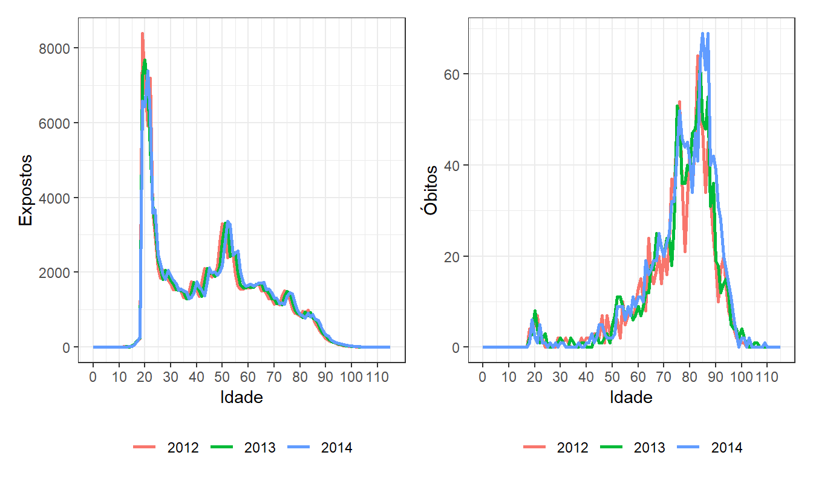
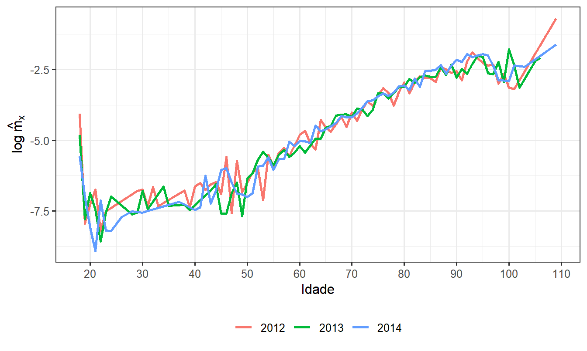
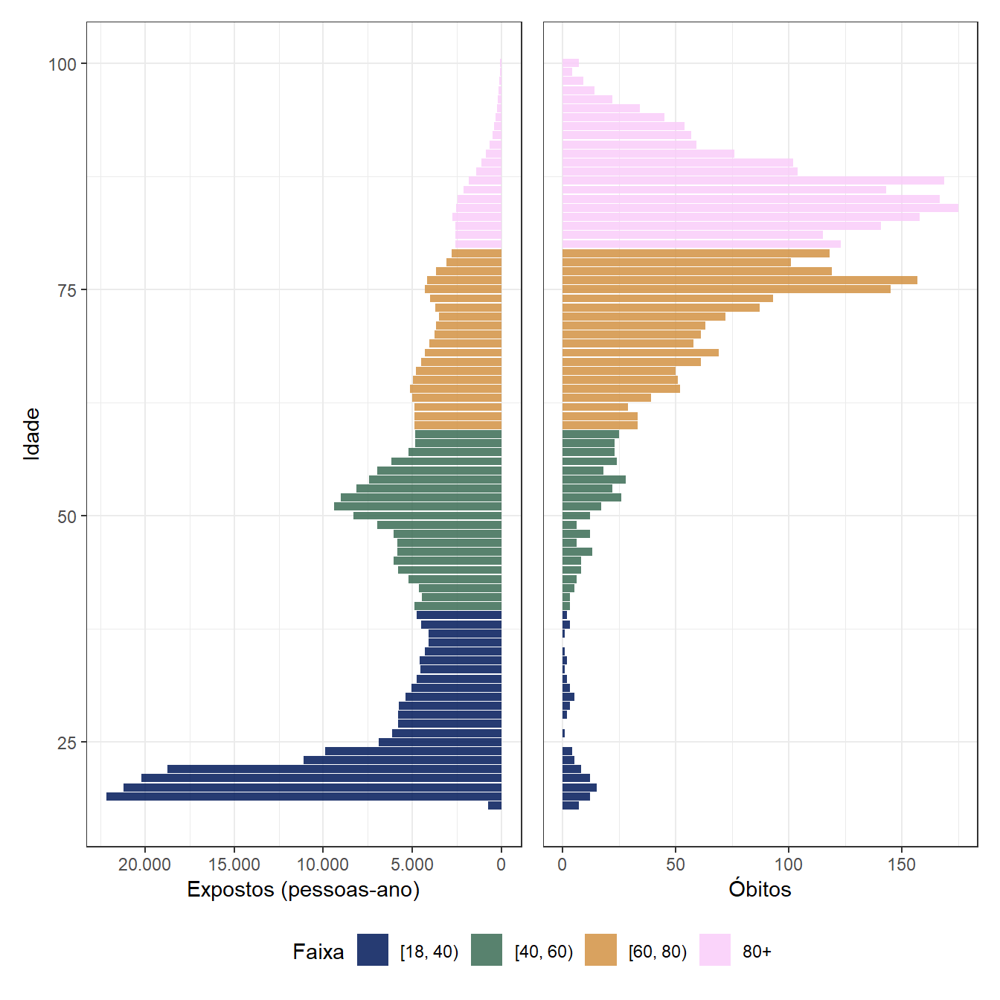
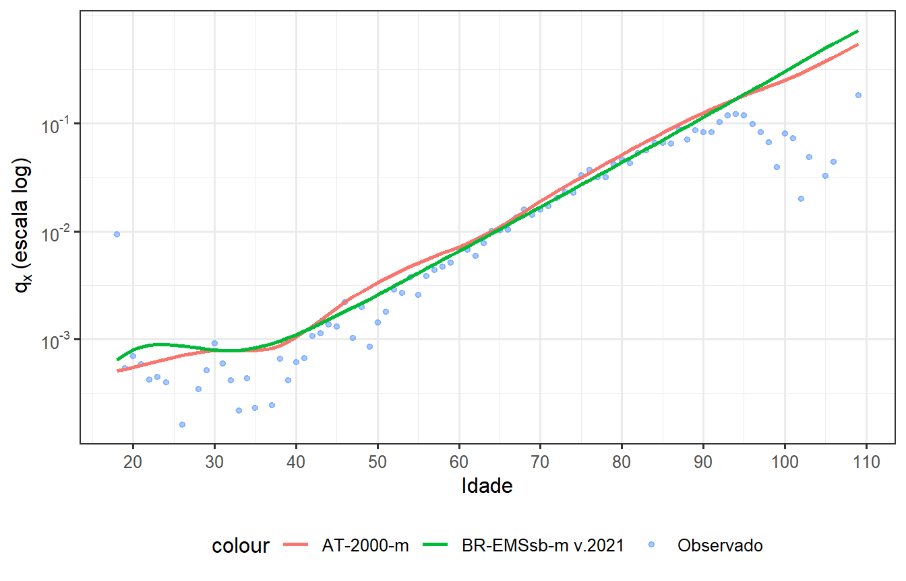
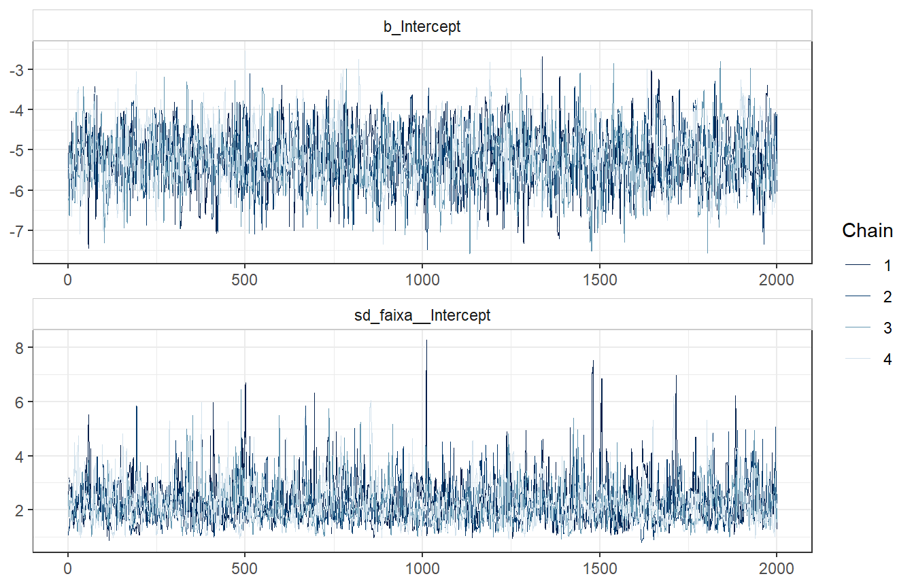
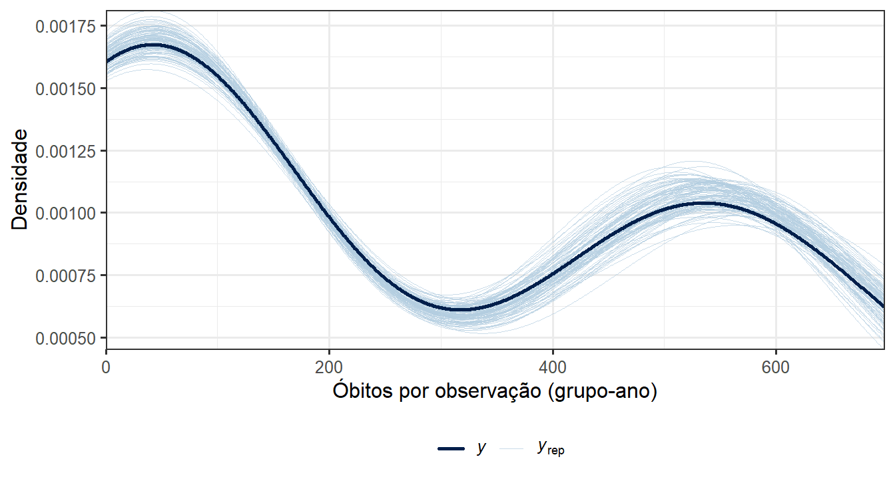
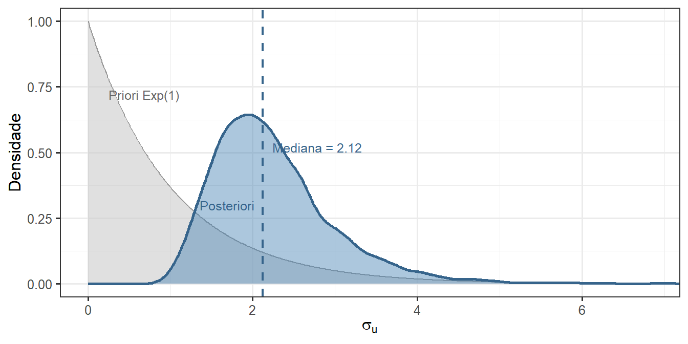
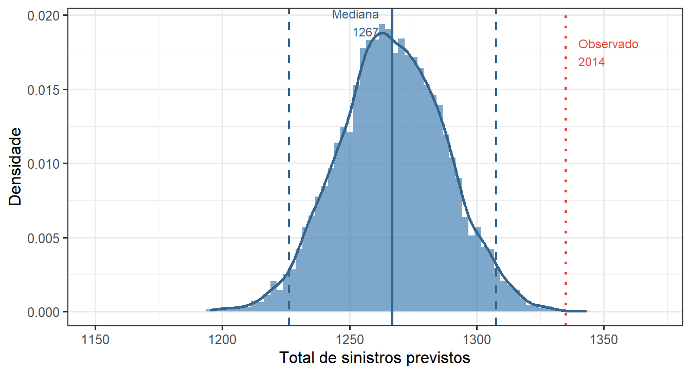

# Teoria da Credibilidade — Laboratório 2, Parte 1 (2026/1)

**Previsão de Mortalidade em Fundo de Pensão via Bühlmann-Straub**

> Disciplina: Teoria da Credibilidade (2026/1) — DME/IM-UFRJ  
> Autor: Arthur Pontes Motta e Catarine Martins
> Professora: Viviana G. R. Lobo

---

## Relatório interativo

O trabalho está publicado como página web com código, gráficos interativos e tabelas completas:

### **[https://arthurpmotta02.github.io/credibilidade-mortalidade-efpc/](https://arthurpmotta02.github.io/credibilidade-mortalidade-efpc/)**

---

## Sobre o trabalho

Análise de mortalidade de uma **Entidade Fechada de Previdência Complementar (EFPC)** brasileira com dados de expostos e óbitos por idade para o triênio 2012–2014. O objetivo central é estimar o número esperado de sinistros $\hat{N}_i^*$ por classe de risco $i$ para o próximo ano, com base em três abordagens de crescente complexidade probabilística.

Os dados cobrem 116 idades ($x = 0, \ldots, 115$), $v = 417{.}964$ pessoas-ano de exposição e $N = 3{.}658$ óbitos ao longo de $T = 3$ anos. As classes de risco são cinco faixas etárias: $[0,18)$, $[18,40)$, $[40,60)$, $[60,80)$ e $80{+}$.

---

## Estrutura do trabalho

| Questão | Conteúdo |
|---|---|
| (i) | Análise exploratória: pirâmide etária, distribuição de expostos e óbitos, $\log\hat{q}_x$ por idade e ano, heatmap de Lexis, métricas de maturidade do plano |
| (ii) | Construção das $m = 5$ faixas de risco com critérios de homogeneidade interna, exposição $v_{it} = E_{it}$ suficiente e relevância atuarial |
| (iii) | Seleção de tábuas de referência (AT-2000 e BR-EMSsb-m v.2021), razão A/E por faixa e 11 testes formais de aderência via `mortalityAdherence` |
| (iv) | Definição dos perfis de risco e exposições $v_{it}$ para o modelo de credibilidade |
| (v) | **Bühlmann-Straub:** estimação iterativa de $\lambda_0$ e $\tau^2$, fatores $\hat{\omega}_i$ e previsão $\hat{N}_i^* = v_i^* \cdot \hat{\lambda}_i^H$ |
| (vi) | **Poisson hierárquico bayesiano** via `brms`/Stan: diagnóstico MCMC, verificação preditiva posterior, posteriori de $\sigma_u$ e IC 95% preditivo de $\sum_i \hat{N}_i^*$ |

---

## Modelos implementados

### 1. Bühlmann-Straub (questão v)

Estimador linear de credibilidade para a frequência de sinistros. Para cada grupo $i = 1,\ldots,5$ e ano $t = 1,2,3$, define-se $F_{it} = N_{it}/v_{it}$, com a hipótese Poisson condicional $E[N_{it}|\theta_i] = \text{Var}[N_{it}|\theta_i] = v_{it}\lambda_0\theta_i$.

O prêmio de credibilidade homogêneo é:

$$\hat{\lambda}_i^H = \hat{\omega}_i \bar{F}_i^v + (1 - \hat{\omega}_i)\hat{\lambda}_0, \qquad \hat{\omega}_i = \frac{v_i}{v_i + \hat{\kappa}}, \qquad \hat{\kappa} = \frac{\hat{\lambda}_0}{\hat{\tau}^2}$$

Os parâmetros $\hat{\lambda}_0$ e $\hat{\tau}^2$ são estimados por momentos não-viciados via algoritmo iterativo (convergência em 5 iterações).

| Parâmetro | Valor |
|---|---|
| $\hat{\lambda}_0$ | $0{,}017921$ |
| $\hat{\tau}^2$ | $0{,}000415$ |
| $\hat{\kappa} = \hat{\lambda}_0/\hat{\tau}^2$ | $43{,}18$ |
| $\hat{\omega}_i$ (grupos com óbitos) | $> 0{,}999$ |
| $\hat{N}^* = \sum_i \hat{N}_i^*$ | $\approx 1{.}267$ sinistros |

---

### 2. Poisson hierárquico bayesiano (questão vi — parte 2)

Modelo Poisson-LogNormal com efeitos aleatórios por grupo:

$$N_{it} \sim \text{Poisson}(\mu_{it}), \qquad \log\mu_{it} = \beta_0 + u_i + \log v_{it}$$

$$\beta_0 \sim \mathcal{N}(-4{,}7,\; 1), \qquad u_i \sim \mathcal{N}(0,\; \sigma_u^2), \qquad \sigma_u \sim \text{Exponencial}(1)$$

A taxa estimada por grupo é $\hat{\lambda}_i = e^{\hat{\beta}_0 + \hat{u}_i}$, e a previsão de sinistros para o próximo período com exposição $v_i^*$ é $\hat{N}_i^* = v_i^* \cdot \hat{\lambda}_i$.

| Parâmetro | Estimativa | IC 95% | $\hat{R}$ | ESS |
|---|---|---|---|---|
| $\beta_0$ | $-5{,}21$ | $(-6{,}60;\; -3{,}81)$ | $1{,}00$ | $1{.}739$ |
| $\sigma_u$ | $2{,}25$ | $(1{,}21;\; 4{,}10)$ | $1{,}00$ | $1{.}689$ |

Previsão: mediana $\approx 1{.}266$ sinistros, IC 95% preditivo $[1{.}196;\; 1{.}341]$. O P95 $\approx 1{.}341$ é o carregamento de segurança para provisionamento de reservas.

---

## Visualizações

### Expostos e óbitos por idade



Distribuição etária da exposição (esquerda) e dos óbitos (direita) para os três anos. A curva de expostos exibe dois picos — entrada de jovens em torno de 19 anos e núcleo ativo entre 40 e 55 anos — enquanto os óbitos concentram-se acima de 60 anos. A estabilidade temporal das curvas indica composição da carteira sem choques no período.

---

### Log da taxa de mortalidade



O $\log\hat{q}_x$ exibe o padrão Gompertz acima dos 25 anos ($q_x \propto e^{\beta x}$, com $\beta \approx 0{,}09$) e a instabilidade esperada acima dos 90 anos, onde $E_x \leq 5$ em muitas células. Essa instabilidade motiva a agregação em faixas etárias para o modelo de credibilidade.

---

### Pirâmide etária



Assimetria estrutural do fundo: $73{,}4\%$ dos expostos pertencem às faixas $[18,40)$ e $[40,60)$, mas apenas $10{,}3\%$ dos óbitos. As faixas $[60,80)$ e $80{+}$ concentram $89{,}7\%$ dos sinistros com $26{,}4\%$ da exposição — desacoplamento que justifica pesos $v_{it}$ distintos no modelo B-S.

---

### Comparação das tábuas de referência



A AT-2000 (americana, 2000) superestima a mortalidade em todas as faixas (A/E $< 1$ sistematicamente). A BR-EMSsb-m v.2021 é mais aderente: A/E global $= 0{,}888$ contra $0{,}802$ da AT-2000. Ambas rejeitam $H_0$ nos 11 testes de `mortalityAdherence` — rejeição esperada com carteiras grandes e tábuas não calibradas especificamente para a população analisada.

---

### Diagnóstico MCMC



Cadeias bem misturadas e sem deriva para $\beta_0$ e $\sigma_u$. $\hat{R} = 1{,}00$ e ESS $> 1{.}500$ para ambos os parâmetros confirmam convergência. O `adapt_delta = 0.99` foi necessário por conta da geometria heterogênea da posteriori — as taxas variam 140 vezes entre $[18,40)$ e $80{+}$, gerando regiões de curvatura muito diferente no espaço paramétrico.

---

### Verificação preditiva posterior



Cada linha cinza é uma réplica $\tilde{N}_{it}$ amostrada da distribuição preditiva posterior; a linha escura são os 15 valores observados ($5$ grupos $\times$ $3$ anos). A sobreposição adequada confirma que o modelo Poisson hierárquico captura a estrutura dos dados sem sinais de superdispersão não modelada.

---

### Priori vs. posteriori de $\sigma_u$



A priori $\sigma_u \sim \text{Exp}(1)$ (área cinza) é atualizada substancialmente pelos dados: a posteriori (área azul) concentra-se com mediana $\approx 2{,}2$ e IC 95% $(1{,}21;\; 4{,}10)$. Um $\sigma_u \approx 2{,}2$ implica que dois grupos podem diferir por $e^{4{,}4} \approx 80$ vezes nas taxas — coerente com $\bar{F}_{80+}/\bar{F}_{[18,40)} \approx 139$.

---

### Distribuição preditiva do total de sinistros



Distribuição preditiva de $\hat{N}^* = \sum_i v_i^* \cdot e^{\hat{\beta}_0 + u_i}$ sobre todas as amostras MCMC. A mediana ($\approx 1{.}267$, linha contínua) coincide com a previsão de Bühlmann-Straub. O observado em 2014 (1.335, linha pontilhada vermelha) situa-se dentro do IC 95% $[1{.}196;\; 1{.}341]$, próximo do limite superior — consistente com a tendência de alta observada no triênio ($+15{,}5\%$ na taxa bruta). O P95 $\approx 1{.}341$ tem interpretação direta como margem de segurança para provisionamento.

---

## Pacotes R utilizados

| Pacote | Função no trabalho |
|---|---|
| `brms` + Stan | Modelo hierárquico bayesiano (MCMC/NUTS) |
| `bayesplot` | Diagnóstico MCMC (`mcmc_trace`, `pp_check`) |
| `mortalityAdherence` | 11 testes formais de aderência às tábuas de mortalidade |
| `scico` | Paletas de cor perceptualmente uniformes (Fabio Crameri) |
| `ggiraph` | Gráficos ggplot2 interativos com tooltips via SVG |
| `gt` | Tabelas com formatação profissional |
| `patchwork` | Composição de múltiplos gráficos |
| `tidyverse` | Manipulação e visualização de dados |

---

## Arquivos

```
.
├── index.qmd                   # Documento-fonte (Quarto)
├── referencias.bib             # Referências bibliográficas (ABNT)
├── dadosfundopensao.csv        # Dados do fundo: E_{it} e N_{it} por idade, 2012–2014
├── at2000_iba.csv              # Tábua AT-2000 masculina
├── brems2021_iba.csv           # Tábua BR-EMSsb-m v.2021
└── README.md
```

---

## Reprodução local

### Dependências R

```r
install.packages(c(
  "tidyverse", "gt", "scales", "patchwork",
  "scico", "ggiraph", "kableExtra",
  "brms", "bayesplot"
))

# mortalityAdherence (GitHub)
remotes::install_url(
  "https://github.com/eduardoflm/mortalityAdherence/archive/refs/heads/main.zip"
)
```

### Renderização

```bash
quarto render index.qmd
```

O chunk `bayes-fit` usa `#| cache: true` — a primeira renderização compila o modelo Stan (~1–2 min) e as seguintes usam o cache. Para forçar recompilação: `quarto render --cache-refresh`.

---

## Referências principais

- Bühlmann, H.; Gisler, A. *A Course in Credibility Theory and Its Applications*. Springer, 2005.
- Klugman, S. A.; Panjer, H. H.; Willmot, G. E. *Loss Models: From Data to Decisions*. 4. ed. Wiley, 2012.
- Bürkner, P.-C. brms: An R Package for Bayesian Multilevel Models Using Stan. *Journal of Statistical Software*, 80(1), 2017.
- Gelman, A. et al. *Bayesian Data Analysis*. 3. ed. CRC Press, 2014.
- de Melo, E. F. L.; Graziadei, H.; Targino, R. `mortalityAdherence`: Mortality Table Adherence Tests. GitHub, 2026.
- Rau, R. et al. *Visualizing Mortality Dynamics in the Lexis Diagram*. Springer, 2018.
- Lord, D.; Miranda-Moreno, L. F. Effects of low sample mean values and small sample size on the estimation of the fixed dispersion parameter of Poisson-gamma models. *Safety Science*, 46, 2008.
- Park, B.-J.; Lord, D.; Hart, J. D. Bias properties of Bayesian statistics in finite mixture of negative binomial regression models in crash data analysis. *Accident Analysis & Prevention*, 42(2), 2010.