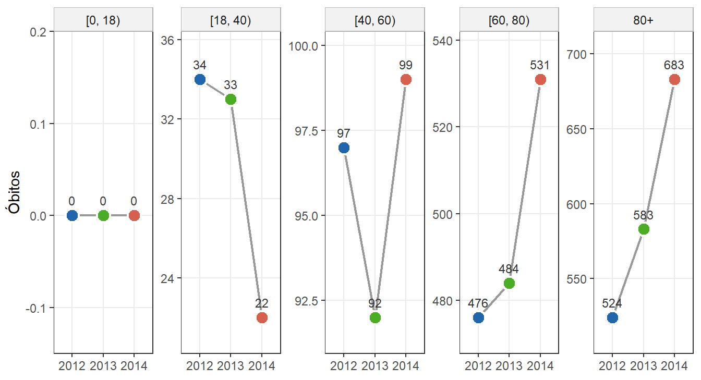
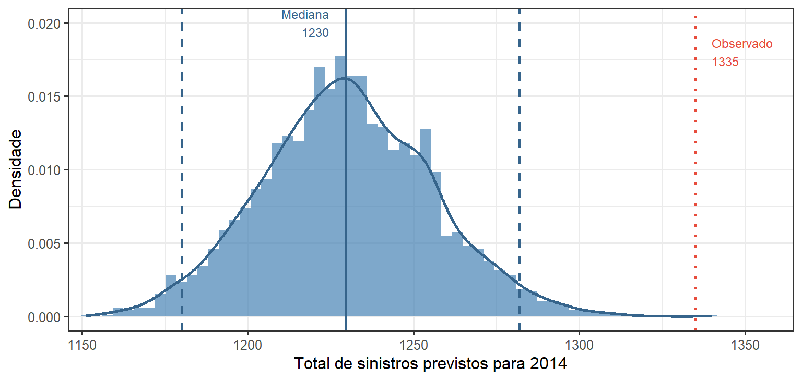

# Teoria da Credibilidade — Laboratório 2, Parte 1 (2026/1)

**Previsão de Mortalidade em Fundo de Pensão via Bühlmann-Straub e Inferência Bayesiana Completa**

> Disciplina: Teoria da Credibilidade (2026/1) — DME/IM-UFRJ  
> Autores: Arthur Pontes Motta e Catarine Martins  
> Professora: Viviana G. R. Lobo

---

## Relatório interativo

O trabalho está publicado como página web com código, gráficos interativos e tabelas completas:

### **[https://arthurpmotta02.github.io/credibilidade-mortalidade-efpc/](https://arthurpmotta02.github.io/credibilidade-mortalidade-efpc/)**

---

## Sobre o trabalho

Análise de mortalidade de uma **Entidade Fechada de Previdência Complementar (EFPC)** brasileira com dados de expostos e óbitos por idade individual para o triênio 2012–2014. O objetivo central é estimar o número esperado de sinistros $\hat{N}_{i,2014}$ por classe de risco $i$, com ajuste em 2012–2013 e validação fora da amostra em 2014. Três abordagens são comparadas: estimador de Bühlmann-Straub (BS), inferência bayesiana completa Poisson-Gamma via Stan, e tábua de mortalidade BR-EMSsb-m v.2021.

Os dados cobrem 116 idades ($x = 0, \ldots, 115$), $v = 417.964$ pessoas-ano de exposição e $N = 3.658$ óbitos ao longo de $T = 3$ anos. O modelo opera com $m = 4$ grupos: $[18,40)$, $[40,60)$, $[60,80)$ e $80{+}$.

---

## Estrutura do trabalho

| Questão | Conteúdo |
|---|---|
| (i) | Análise exploratória: pirâmide etária, distribuição de expostos e óbitos, $\log\hat{m}_x$, heatmap de Lexis, métricas de maturidade |
| (ii) | $m = 4$ faixas de risco com critérios atuariais; validação objetiva por PELT (*changepoint*) |
| (iii) | Tábuas AT-2000 e BR-EMSsb-m v.2021; razão A/E por faixa; 11 testes de aderência via `mortalityAdherence` |
| (iv) | Definição dos perfis de risco e exposições $v_{it}$ |
| (v) | **Bühlmann-Straub:** estimação iterativa de $\hat{\lambda}_0$ e $\hat{\tau}^2$; $\hat{N}_{i,2014} = v_{i,2014} \cdot \hat{\lambda}_i^H$; validação em 2014 |
| (vi) | **Poisson-Gamma via Stan:** inferência bayesiana completa; diagnóstico MCMC; PPC; IC 95% preditivo |

---

## Modelos

### Bühlmann-Straub (questão v)

$$F_{it} = \frac{N_{it}}{v_{it}}, \quad \hat{\lambda}_i^H = \hat{\omega}_i \bar{F}_i^v + (1-\hat{\omega}_i)\hat{\lambda}_0, \quad \hat{\omega}_i = \frac{v_i}{v_i+\hat{\kappa}}, \quad \hat{\kappa} = \frac{\hat{\lambda}_0}{\hat{\tau}^2}$$

| Parâmetro | Valor |
|---|---|
| $\hat{\lambda}_0$ | $0{,}02131$ |
| $\hat{\tau}^2$ | $0{,}000374$ |
| $\hat{\kappa}$ | $56{,}95$ |
| $\hat{\omega}_i$ (todos os grupos) | $> 0{,}999$ |
| $\hat{N}^*_{2014}$ total | $1.230$ sinistros |
| Observado 2014 | $1.335$ sinistros |
| Erro global BS | $-7{,}9\%$ |
| Erro global tábua | $+9{,}3\%$ |

### Poisson-Gamma Bayesiano (questão vi)

$$N_{it}\mid\lambda_{it}\sim\text{Poisson}(\lambda_{it}),\quad \lambda_{it}=v_{it}\theta_i\lambda_0,\quad \theta_i\sim\text{Gamma}(\theta_0,\theta_0),\quad \lambda_0,\theta_0\sim\text{Gamma}(0{,}001,\,0{,}001)$$

4 cadeias, `warmup=10.000`, `iter=30.000`, `thin=30`. $\hat{R}<1{,}001$ e ESS $>2.000$ para todos os parâmetros. Previsão 2014: mediana $\approx 1.230$, IC 95% $[1.144;\,1.322]$.

---

## Visualizações

> Gráficos marcados com ⭢ são interativos e estão disponíveis apenas no [relatório web](https://arthurpmotta02.github.io/credibilidade-mortalidade-efpc/).

### Questão (i) — Análise Exploratória


⭢ **Heatmap de Lexis** (superfície de log-mortalidade por idade e ano) — interativo no relatório web.




---

### Questão (ii) — Perfil Etário e PELT

⭢ **Curva $\hat{m}_x$ por faixa com pontos de mudança PELT** — interativo no relatório web.  
`index_files/figure-html/g-faixas-pelt-1.png` (versão estática gerada pelo Quarto)

---

### Questão (iii) — Tábuas de Referência


⭢ **Razão A/E por faixa etária** — interativo no relatório web.

---

### Questão (vi) — Diagnóstico e Posteriores Bayesianas




---

## Arquivos

```
.
├── index.qmd               # Documento-fonte (Quarto)
├── referencias.bib         # Referências bibliográficas (ABNT)
├── dadosfundopensao.csv    # Dados: Eit e Nit por idade, 2012–2014
├── at2000.iba.csv          # Tábua AT-2000 masculina
├── brems2021.iba.csv       # Tábua BR-EMSsb-m v.2021
├── fit_stan_efpc.rds       # Fit Stan salvo (gerado na primeira renderização)
└── README.md
```

> **`fit_stan_efpc.rds`:** gerado automaticamente na primeira renderização e reutilizado nas seguintes. O código verifica compatibilidade pelo número de grupos (`dim(theta)[2] == m`). Para forçar reajuste, delete o arquivo antes de renderizar.

---

## Reprodução local

### Dependências R

```r
install.packages(c(
  "tidyverse", "gt", "gtExtras", "scales", "patchwork",
  "scico", "ggiraph", "kableExtra",
  "rstan", "bayesplot", "changepoint"
))

# mortalityAdherence (GitHub)
remotes::install_url(
  "https://github.com/eduardoflm/mortalityAdherence/archive/refs/heads/main.zip"
)
```

### Renderização

```bash
quarto render index.qmd
```

A primeira renderização leva 10–20 minutos (Stan: 4 cadeias × 30.000 iterações). As seguintes reutilizam o `.rds` salvo.

---

## Referências principais

- Bühlmann, H.; Gisler, A. *A Course in Credibility Theory and Its Applications*. Springer, 2005.
- Klugman, S. A.; Panjer, H. H.; Willmot, G. E. *Loss Models: From Data to Decisions*. 4. ed. Wiley, 2012.
- Killick, R.; Fearnhead, P.; Eckley, I. A. Optimal Detection of Changepoints With a Linear Computational Cost. *JASA*, 107(500), 2012.
- Gelman, A. et al. *Bayesian Data Analysis*. 3. ed. CRC Press, 2014.
- Pitacco, E. et al. *Modelling Longevity Dynamics for Pensions and Annuity Business*. Oxford, 2009.
- de Melo, E. F. L.; Graziadei, H.; Targino, R. `mortalityAdherence`. GitHub, 2026.
- Rau, R. et al. *Visualizing Mortality Dynamics in the Lexis Diagram*. Springer, 2018.
- PREVIC. Portaria PREVIC n.º 835, de 3 de setembro de 2020.