# Previsão de Mortalidade em Fundo de Pensão via Bühlmann-Straub

**Teoria da Credibilidade — Laboratório 2 (2026/1)**  
DME / Instituto de Matemática — UFRJ

> **Autores:** Arthur Pontes Motta e Catarine Martins  
> **Professora:** Viviana G. R. Lobo

---

## Relatório interativo

O trabalho está publicado como página web com código, gráficos interativos e tabelas completas:

### 🔗 [arthurpmotta02.github.io/credibilidade-mortalidade-efpc](https://arthurpmotta02.github.io/credibilidade-mortalidade-efpc/)

---

## Sobre o trabalho

Análise de mortalidade de uma **Entidade Fechada de Previdência Complementar (EFPC)** brasileira com dados de expostos e óbitos por idade individual para o triênio 2012–2014. O objetivo central é estimar o número esperado de sinistros $\hat{N}_{i,2014}$ por classe de risco $i$, com ajuste em 2012–2013 e validação fora da amostra em 2014.

Os dados cobrem 116 idades ($x = 0, \ldots, 115$), $v = 417.964$ pessoas-ano de exposição e $D = 3.658$ óbitos ao longo de $T = 3$ anos. O modelo opera com $m = 4$ grupos: $[18,40)$, $[40,60)$, $[60,80)$ e $80+$.

---

## Estrutura do trabalho

| Questão | Conteúdo |
|---------|----------|
| **(i)**   | Análise exploratória: pirâmide etária, distribuição de expostos e óbitos, $\log\hat{m}_x$, superfície de Lexis, curva de sobrevivência, métricas de maturidade |
| **(ii)**  | Segmentação em $m = 4$ faixas de risco com critérios atuariais; validação objetiva por PELT-Poisson com custo de verossimilhança Poisson analítico |
| **(iii)** | Tábuas AT-2000, BR-EMSsb-m v.2021 e Pub-2010 Retiree; razão A/E por faixa; 11 testes de aderência via `mortalityAdherence` |
| **(iv)**  | Definição dos perfis de risco e exposições $v_{it}$ |
| **(v)**   | **Bühlmann-Straub:** estimação iterativa de $\hat{\lambda}_0$ e $\hat{\tau}^2$; previsão $\hat{N}_{i,2014} = v_{i,2014}\cdot\hat{\lambda}_i^H$; validação e frankenstein atuarial |
| **(vi)**  | **Poisson-Gama via Stan:** inferência bayesiana completa; diagnóstico MCMC; PPC; análise de sensibilidade às prioris; distribuição preditiva com IC 95% |

---

## Resultados principais

### Bühlmann-Straub

$$F_{it} = \frac{N_{it}}{v_{it}}, \qquad \hat{\lambda}_i^H = \hat{\omega}_i \bar{F}_i^v + (1-\hat{\omega}_i)\hat{\lambda}_0, \qquad \hat{\omega}_i = \frac{v_i}{v_i+\hat{\kappa}}, \qquad \hat{\kappa} = \frac{\hat{\lambda}_0}{\hat{\tau}^2}$$

| Parâmetro | Valor |
|-----------|-------|
| $\hat{\lambda}_0$ | $0{,}02131$ |
| $\hat{\tau}^2$ | $0{,}000374$ |
| $\hat{\kappa}$ | $56{,}95$ |
| $\hat{\omega}_i$ (todos os grupos) | $> 0{,}999$ |
| $\hat{N}^*_{2014}$ total | $1.230$ sinistros |
| Observado 2014 | $1.335$ sinistros |
| Erro global BS | $-7{,}9\%$ |
| Erro global BR-EMS | $+9{,}3\%$ |

### Poisson-Gama Bayesiano

$$N_{it}\mid\lambda_{it}\sim\text{Poisson}(\lambda_{it}),\quad \lambda_{it}=v_{it}\theta_i\lambda_0,\quad \theta_i\sim\text{Gama}(\theta_0,\theta_0),\quad \lambda_0,\theta_0\sim\text{Gama}(0{,}001,\,0{,}001)$$

4 cadeias · `warmup = 10.000` · `iter = 30.000` · `thin = 30`  
$\hat{R} < 1{,}001$ e $n_{\text{eff}} > 2.600$ para todos os parâmetros.  
Previsão 2014: mediana $\approx 1.230$ · IC 95% $[1.144;\,1.322]$

---

## Visualizações

### Questão (i) — Análise Exploratória

**Pirâmide etária por idade individual**


**Distribuição relativa por faixa etária**

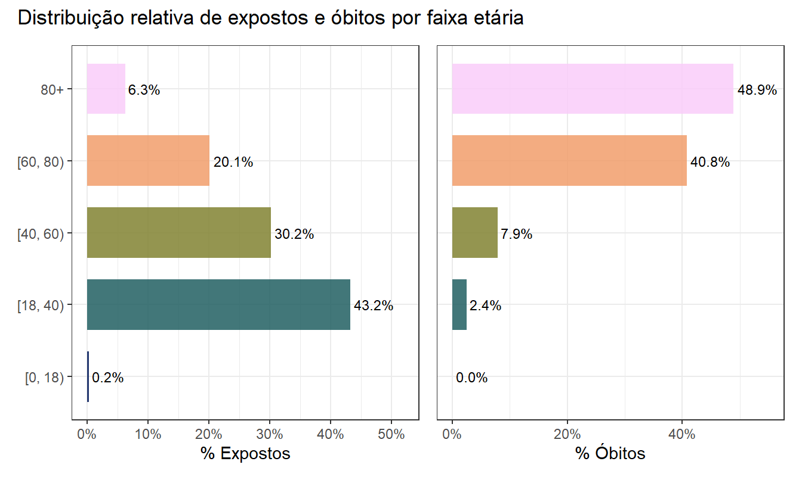

**Expostos e óbitos por idade e ano**


**Log da taxa central de mortalidade**


**Superfície de Lexis — heatmap de log-mortalidade**

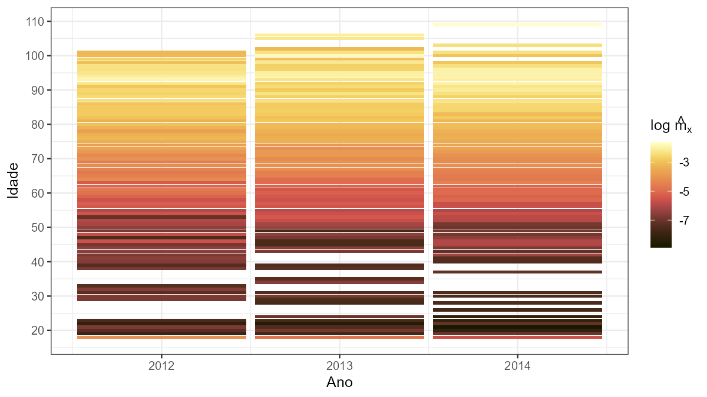

**Função de sobrevivência acumulada**

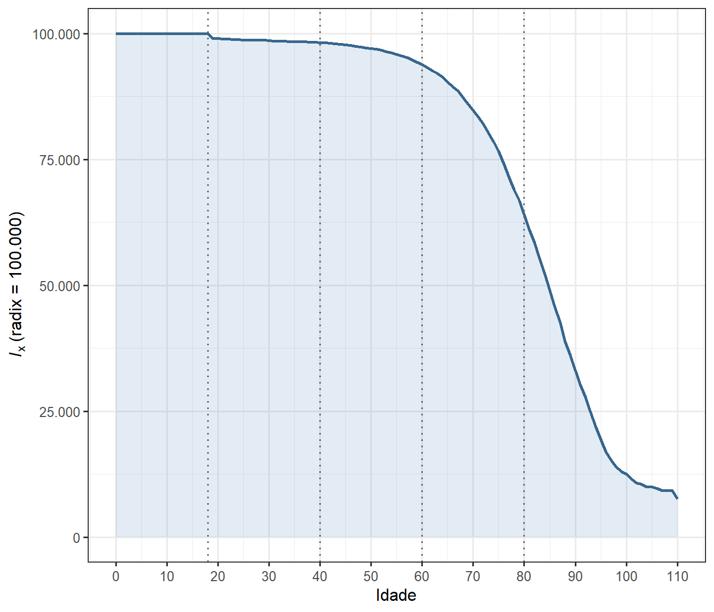

---

### Questão (ii) — Perfis de Risco e PELT-Poisson

**Curva de mortalidade com pontos de mudança PELT-Poisson**

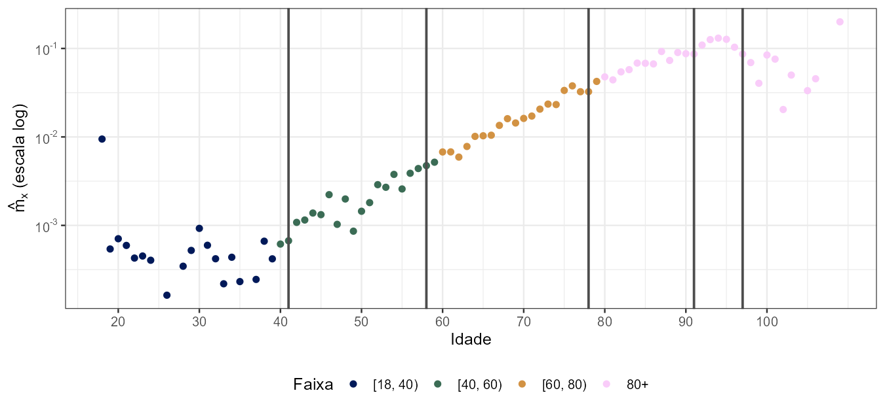

**Dispersão intragrupo das taxas $\hat{m}_x$**

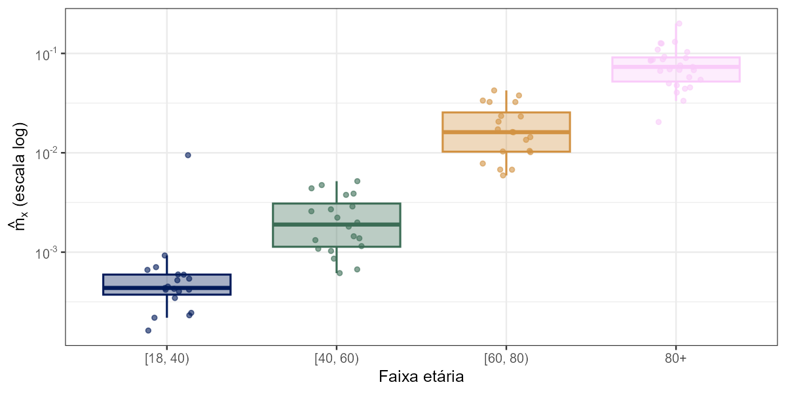

---

### Questão (iii) — Tábuas de Referência

**Comparação das tábuas com a experiência observada**


**Razão A/E por faixa etária**

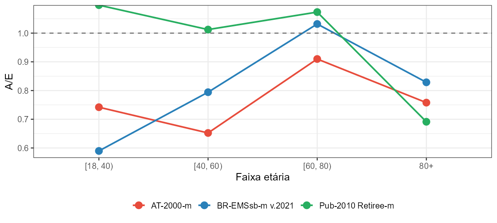

---

### Questão (vi) — Inferência Bayesiana

**Trajetórias das cadeias MCMC**

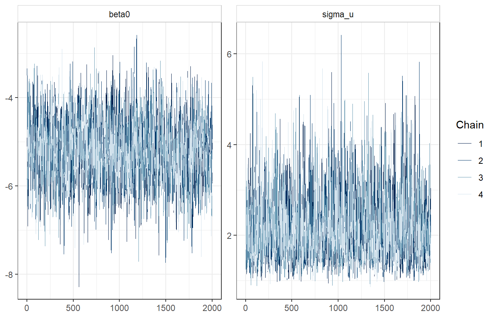

**Distribuição posterior de $\omega_i$**

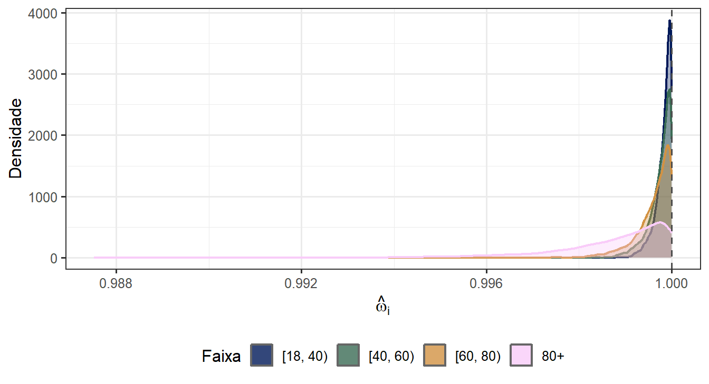

**Verificação preditiva posterior (PPC)**

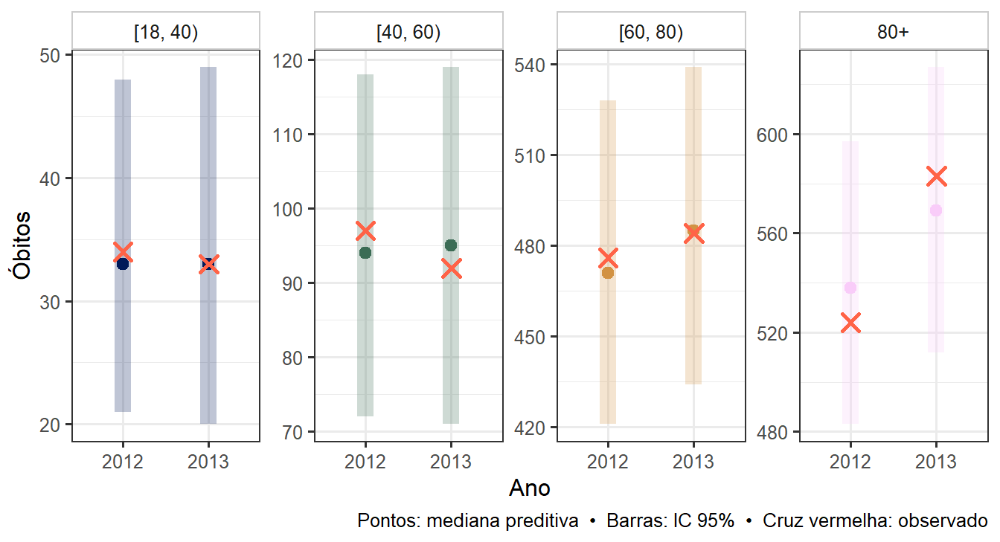

**Distribuições posteriores de $\theta_i$**

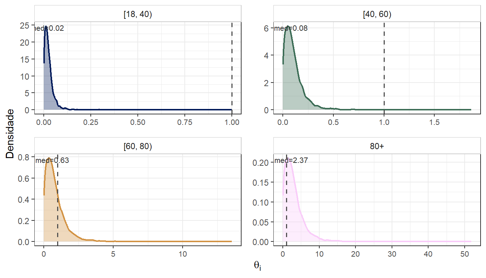

**Distribuição preditiva do total de sinistros (2014)**

![Distribuição preditiva posterior do total de sinistros em 2014. Mediana ≈ 1.230, IC 95% [1.144; 1.322], observado = 1.335.](index_files/figure-html/stan-pred-total-1.png)

**Comparação final: credibilidade vs. tábuas de referência**

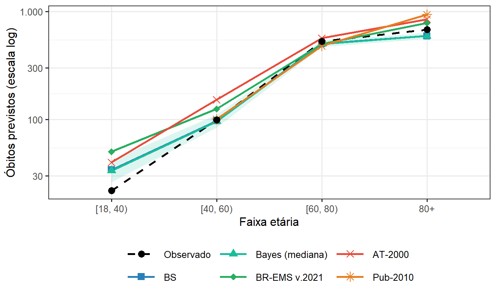

---

## Arquivos

```
.
├── index.qmd                              # Documento-fonte (Quarto)
├── index.html                             # Relatório renderizado (11 MB)
├── referencias.bib                        # Referências bibliográficas (ABNT)
├── dadosfundopensao.csv                   # Dados: Eit e Dit por idade, 2012–2014
├── at2000.iba.csv                         # Tábua AT-2000 masculina
├── brems2021.iba.csv                      # Tábua BR-EMSsb-m v.2021
├── fit_stan_efpc.rds                      # Fit Stan principal (4 cadeias × 30k iter)
├── fit_stan_sens_Vaga__a__b__0__001_.rds  # Fit Stan — priori vaga (a = b = 0,001)
├── fit_stan_sens_Moderada__a__b__1_.rds   # Fit Stan — priori moderada (a = b = 1)
├── index_files/
│   └── figure-html/                       # PNGs de todas as figuras
└── .nojekyll                              # Necessário para GitHub Pages
```

> **Fits Stan (`.rds`):** gerados automaticamente na primeira renderização e reutilizados nas seguintes. O código verifica compatibilidade pelo número de grupos (`dim(theta)[2] == m`). Para forçar reajuste, delete o arquivo antes de renderizar. O arquivo principal pesa ~2 MB; cada cenário de sensibilidade ~1,7 MB.

---

## Reprodução local

### Dependências R

```r
install.packages(c(
  "tidyverse", "gt", "gtExtras", "scales", "patchwork",
  "scico", "ggiraph", "kableExtra", "fastcpd", "mortSOA",
  "rstan", "bayesplot"
))

# mortalityAdherence (GitHub)
remotes::install_url(
  "https://github.com/eduardoflm/mortalityAdherence/archive/refs/heads/main.zip"
)
```

### Renderização

```bash
quarto render index.qmd
```

> A primeira renderização leva 10–20 minutos (Stan: 4 cadeias × 30.000 iterações para o modelo principal + 2 cadeias × 15.000 para cada cenário de sensibilidade). As seguintes reutilizam os `.rds` salvos.

---

## Referências principais

- Bühlmann, H.; Gisler, A. *A Course in Credibility Theory and Its Applications*. Springer, 2005.
- Klugman, S. A.; Panjer, H. H.; Willmot, G. E. *Loss Models: From Data to Decisions*. 4. ed. Wiley, 2012.
- Killick, R.; Fearnhead, P.; Eckley, I. A. Optimal Detection of Changepoints With a Linear Computational Cost. *JASA*, 107(500), 2012.
- Pitacco, E. et al. *Modelling Longevity Dynamics for Pensions and Annuity Business*. Oxford, 2009.
- de Melo, E. F. L.; Graziadei, H.; Targino, R. `mortalityAdherence`. GitHub, 2026.
- Rau, R. et al. *Visualizing Mortality Dynamics in the Lexis Diagram*. Springer, 2018.
- Society of Actuaries. *The 2000 Mortality Table*. Schaumburg, IL, 2000.
- Society of Actuaries. *Pub-2010 Public Pension Mortality Tables*. 2014.
- FenaPrevi. *Tábua BR-EMSsb-m v.2021*. São Paulo, 2021.
- PREVIC. *Portaria PREVIC n.º 835, de 3 de setembro de 2020*.
- ABRAPP. *Consolidado Estatístico*. 2022.